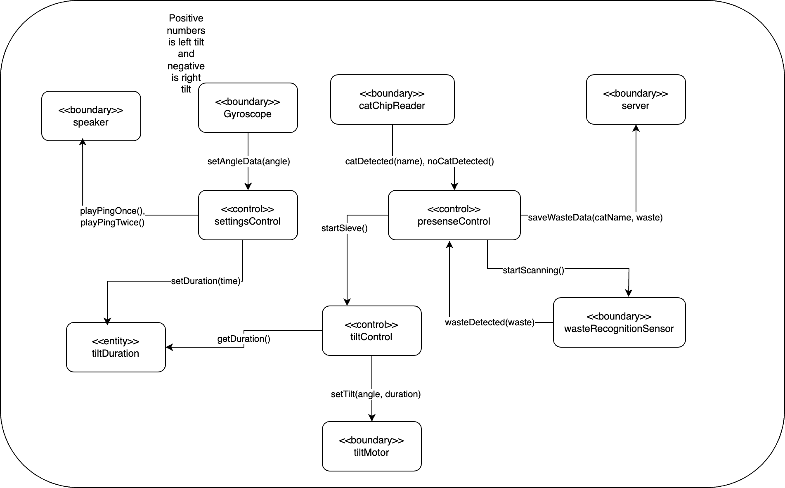
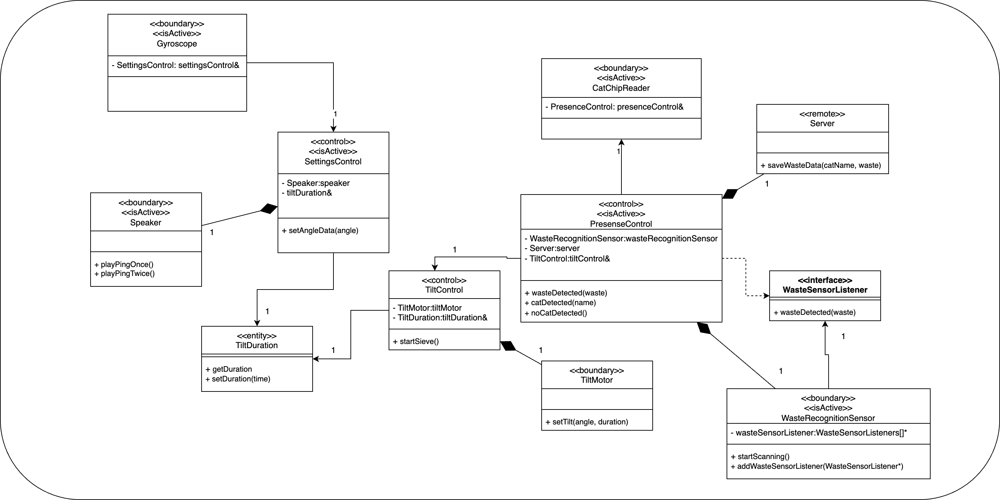
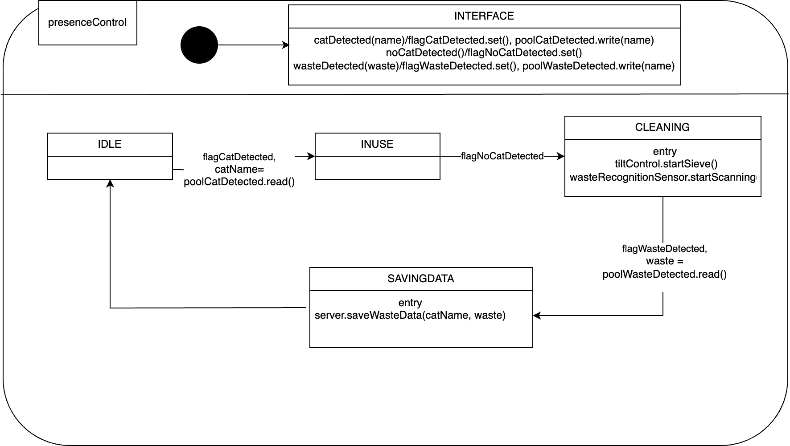
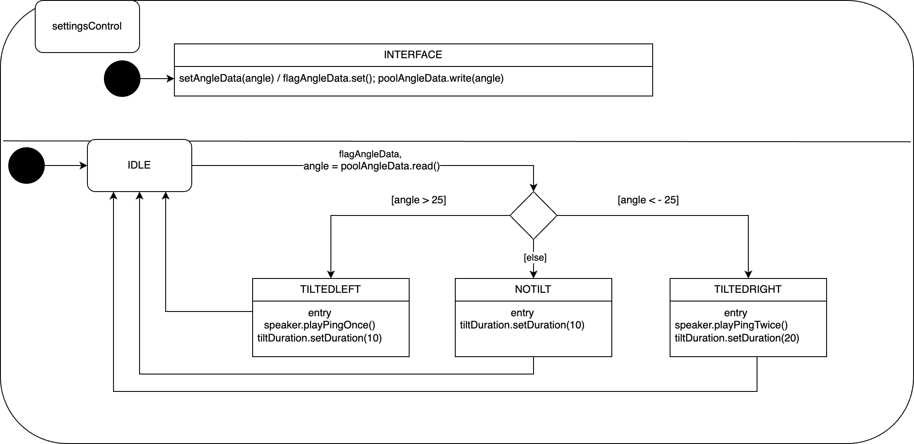

### UC1
Als de kat in de kattenbak gaat, wordt de kat geidentificeerd. Als de kat klaar is, wordt
de kattenbak schoongemaakt door het voor bijvoorbeeld 10 sec cyclisch te zeven. De
hoeveelheid en soort afval wordt gemeten en naar een server gestuurd.

## UC2
De tijd dat er cyclisch gezeefd moet worden, kun je instellen door de kattenbak (als er
geen kat in zit) te tilten: tilt je hem meer dan 25 graden naar links, dan hoor je een piep, en
wordt de tijd 10 seconden (normale modus). tilt je hem mee dan 25 graden naar rechts, dan
hoor je 2 piepjes, en wordt die tijd 20 seconden.

| **Naam** | UC01 Kat Herkennings Systeem |
| --- | --- |
| **Actor** | Kat |
| **Samenvatting** | Techniek om te zorgen dat het systeem weet wanneer er een kat aanwezig is en ook welke specifieke kat erin zit. |
| **Preconditie** | - |
| **Scenario** | 1. Systeem herkend de kat.   2. Kat maakt gebruik van de kattenbak. 3. Kat verlaat kattenbak. 4. Systeem start met zeven. 5. Systeem herkent afval. 6. Systeem stuurt type afval met naam van kat door naar server |
| **Postconditie** | Schone kattenbak |
| **Uitzonderingen** | Systeem kan een foutmelding weergeven als de kat niet wordt herkend. |

| **Naam** | UC02 Zeeftijd instellingssysteem |
| --- | --- |
| **Actor** | - |
| **Samenvatting** | Techniek om te zorgen dat de duur van het zeven kan worden aangepast door de gebruiker. |
| **Preconditie** |  |
| **Scenario** | 1. De bak wordt opgepakt en gekanteld. Een gyroscoop meet de angle. 2. Als de hoek meer dan 25 graden naar links is, speelt het systeem een piep af en wordt de duur ingesteld op 10 seconden. 3. Als de hoek meer dan 25 graden naar rechts is, speelt het systeem 2 piepjes af en wordt de tijd 20 seconden. |
| **Postconditie** | Bak is terug bij 0 graden en klaar voor hergebruik, de duur is opgeslagen. |
| **Uitzonderingen** | Als de hoek niet de 25 graden heeft overschreden, wordt de default tijd van 10 seconden aangehouden. |

### Object Model

Hierin zie je de flow, de catChipReader stuurt elke keer als er een verandering is (wel een kat herkend of niet) de naam van de kat die hij uit de chip van de kat leest door naar de control, na het ontvangen van dit bericht wacht de control totdat de kat weg is en dan stuurt hij naar het zeven control dat hij moet starten en zegt hij tegen de afvalherkenningssensor dat hij moet gaan scannnen. Na het ontvangen van een reactie van de sensor welk afval is herkend stuurt hij dit samen met de naam van de kat door naar de database / server.

### Klassediagram

Alle functies zijn geschoven naar de publieke operaties van de klasses waar ze bij horen, er zijn pointers toegevoegd in de private members waar nodig. Er is een listener toegevoegd voor de wasteRecognitionSensor om de circular dependency die hier is ontstaan te doorbreken. Hier heb ik geen handler toegevoegd om de reden dat er maar 1 wasteRecognitionSensor is en het dus geen productieve waarde toevoegd om een handler erbij te zetten. Sterker nog, hier maak je het nodeloos complex mee. 

### STD Presence Control

Het programma start in idle en wacht op de flag dat er een kat is, dan leest het systeem de naam van de kat uit en wacht tot de kat weer is vertrokken. Dan zegt het systeem dat de bak moet gaan schoonmaken en beginnen met het scannen van het afval. Vervolgens wacht het systeem tot het afval is gescanned en teruggegeven, dit leest het systeem uit en stuurt dit samen met de meest recent uitgelezen naam van de kat door naar de server en gaat dan terug naar idle. 

(Code Presence Control)[https://github.com/2024-TICT-TV2SE3-24/s3-personal-ingmarvdsande/blob/main/Opdrachten/Slimme_Kattenbak/PresenceControl.hpp]

### STD Settings Control

Het systeem begint weer in idle en wacht tot het een bericht krijgt van de gyroscope dat er een verandering in de angle is. De meest recente angle wordt uitgelezen en in een variabele gezet. Vervolgens kijken we of de angle meer dan 25 graden positief is, zo ja is de bak naar links getilt en moet het systeem een ping afspelen en de duur van het zeven op 10 seconden zetten. Als de angle minder dan - 25 graden is, betekent dit dat de bak naar rechts is getilt, dan speelt het systeem 2 pings af via de speaker en slaat de duratie van het zeven op als 20 seconden. Is de hoek minder dan dat, door user error of gewoon als hij net uit de doos komt, slaat het systeem een "default" waarde van 10 seconden op. 

(Code Settings Control)[https://github.com/2024-TICT-TV2SE3-24/s3-personal-ingmarvdsande/blob/main/Opdrachten/Slimme_Kattenbak/SettingsControl.hpp]
